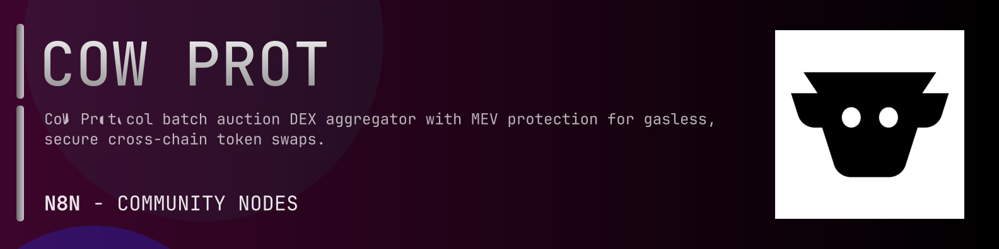

# @n8n-dev/n8n-nodes-cow-protocol



[](https://www.npmjs.com/package/@n8n-dev/n8n-nodes-cow-protocol)
[](https://opensource.org/licenses/MIT)

---

**Stop writing cow-protocol API integrations by hand.**

Every time you connect n8n to cow-protocol, you waste hours mapping endpoints, defining parameters, and debugging schemas. You copy-paste from docs, fix edge cases, and pray nothing breaks.

**What if connecting n8n to cow-protocol took 5 minutes, not half a day?**

This node gives you **1+ resources** out of the box: **Default**: with full CRUD operations, typed parameters, and zero manual configuration.

---

## What You Get

- **Zero boilerplate**: Resources, operations, and fields are pre-configured and ready to use
- **Full CRUD**: Create, read, update, and delete support where the API allows it
- **Typed parameters**: No more guessing field types
- **Built-in auth**: API key authentication, ready to go
- **Declarative**: Native n8n performance, no custom execute() overhead

---

## Install

```bash
npm install @n8n-dev/n8n-nodes-cow-protocol
```

**Or in n8n:**
1. **Settings → Community Nodes → Install**
2. Search: `@n8n-dev/n8n-nodes-cow-protocol`
3. Click **Install**

---

## Quick Start

1. Install the node (above)
2. Add credentials: **cow-protocol API** → paste your API key
3. Drag the **cow-protocol** node into your workflow
4. Pick a resource → pick an operation → done.

That's it. No configuration files. No code. It just works.

---

## Resources

<details>
<summary><b>Default</b> (22 operations)</summary>

- Post Create a new order In order to replace an existing order with a new one the appData must contain a valid replacement order UID HTTPS github com cowprotocol app data blob main src schemas v1 1 0 JSON L62 then the indicated order is cancelled and a new one placed This allows an old order to be cancelled AND a new order to be created in an atomic operation with a single signature This may be useful for replacing orders when on chain prices move outside of the original order s limit price
- Delete Cancel multiple orders by marking them invalid with a timestamp
- Post Get existing orders from the list of UIDs
- Get existing order from UID
- Get the status of an order
- Get orders by settlement transaction hash
- Get existing trades paginated
- Get the current batch auction
- Get orders of one user paginated
- Get native price for the given token
- Post Quote a price and fee for the specified order parameters
- Get information about a solver competition
- Get information about solver competition
- Get information about the most recent solver competition
- Get the API s current deployed version
- Get the full appData from contract appDataHash
- Put Registers a full appData so it can be referenced by appDataHash
- Put Registers a full appData and returns appDataHash
- Get the total surplus earned by the user UNSTABLE
- Post Simulate an arbitrary order
- Get Tenderly simulation request for an order
- Get Debug an order s lifecycle

</details>

---

## Why This Node?

**Without this node:**
- Hours of manual API integration
- Copy-pasting from cow-protocol docs
- Debugging auth, pagination, error handling
- Maintaining your own client code

**With this node:**
- Install → configure → use. 5 minutes.
- Auto-generated from the official cow-protocol OpenAPI spec
- Always up to date when the API changes
- Native n8n performance

---

## Auto-Generated
This node was auto-generated from the official **cow-protocol** OpenAPI specification using
[@n8n-dev/n8n-openapi-node-ultimate](https://github.com/kelvinzer0/n8n-openapi-node-ultimate),
then validated against the live API so you get accurate types and real parameters, not guesswork.

When the cow-protocol API updates, this node updates too.

---

## Support This Project

If this node saved you hours of work, consider supporting continued development, new APIs, better error handling, and faster updates.

[](https://n8n-code.github.io/membership/#/eyJ0aXRsZSI6IktlZXAgSXQgTW92aW5nIiwiZGVzYyI6Ik9uZSBkZXZlbG9wZXIgYnVpbHQgYSB0b29sIHRoYXQgYXV0by1nZW5lcmF0ZXNcbm44biBub2RlcyBmcm9tIGFueSBPcGVuQVBJIHNwZWMuXG5cbllvdXIgZG9uYXRpb24gZnVuZHMgbmV3IGZlYXR1cmVzLCBtb3JlIEFQSSBzdXBwb3J0LFxuYW5kIGJldHRlciB0b29saW5nIGZvciBldmVyeSBkZXZlbG9wZXIgYWZ0ZXIgeW91LiIsInRhcmdldCI6NTAwMCwiYWRkcmVzc2VzIjp7ImV0aGVyZXVtIjoiMHhmMDU1NWQ0MGRiRkI0ZTNCZjA3MDQ0MjgyQjc4RjJmRTFmNTFFZjcyIiwic29sYW5hIjoiNlpEVk5BYmpZZExEcXo4cGt3VUNHYllaNVV3QlFranB0QzU1Wk5vTFcybVUifSwiZGlzY29yZCI6Imh0dHBzOi8vZGlzY29yZC5nZy9wdERaOGU0aDkzIn0)

---

## License

MIT © [kelvinzer0](https://github.com/n8n-code)
